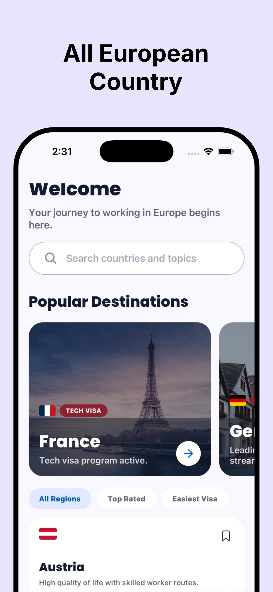
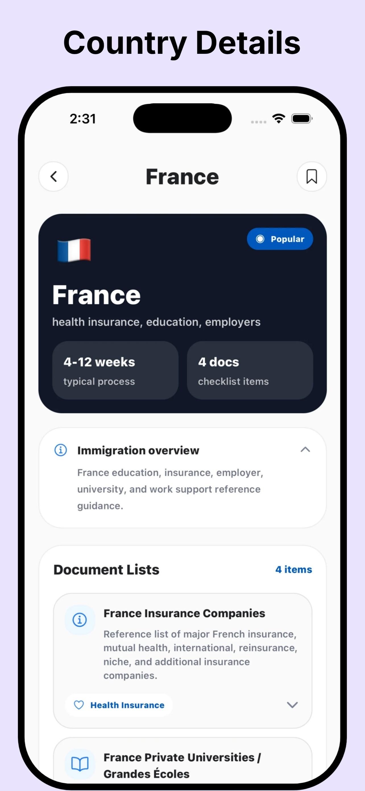
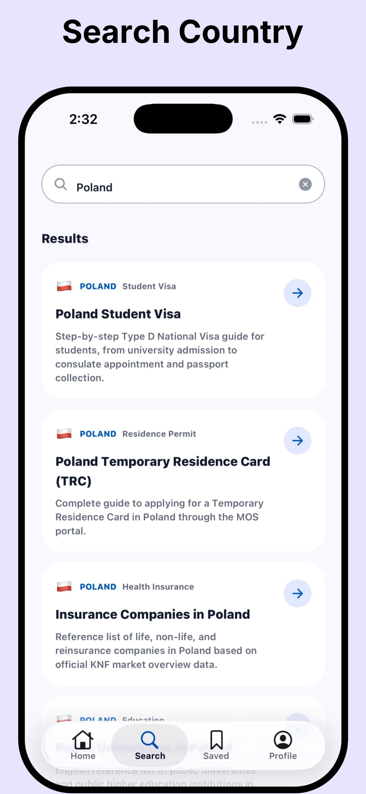
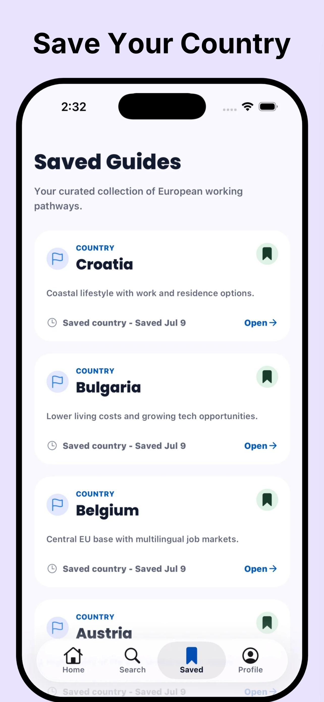
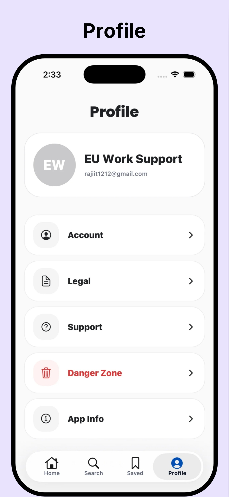

<h1>EU Work Support</h1>

<strong>Your journey to working in Europe begins here.</strong>

  
  
  

 

EU Work Support is an iOS app for anyone planning to live and work in Europe. Explore 27 European countries, read clear, step-by-step guides on work visas, residence permits and the documents you need, and save the ones that matter to you.

Every guide is researched from official government, European Union, embassy and university sources, then simplified and organised so it is easy to follow. Browse for free, and unlock every guide with a single one-time Premium purchase. No account is needed.

 

## 📱 Screenshots

  
  &nbsp;
  
  &nbsp;
  
  &nbsp;
  
  &nbsp;
  

 

## ✨ Features

<table>
  <tr>
    <td width="50%" valign="top">
      <h3>🇪🇺 Explore Europe</h3>
      Browse 27 European countries, discover popular destinations, and filter by <em>Top rated</em> or <em>Easiest visa</em>.
    </td>
    <td width="50%" valign="top">
      <h3>🗺️ Country guides</h3>
      An immigration overview, typical processing times, document checklists and reference lists for each country.
    </td>
  </tr>
  <tr>
    <td width="50%" valign="top">
      <h3>🛂 Step-by-step visa guides</h3>
      Visas, residence permits, health insurance and education, explained from start to finish.
    </td>
    <td width="50%" valign="top">
      <h3>🔎 Search everything</h3>
      Find any country, guide title or category in seconds.
    </td>
  </tr>
  <tr>
    <td width="50%" valign="top">
      <h3>🔖 Save for later</h3>
      Bookmark countries and guides and keep them together in the Saved tab.
    </td>
    <td width="50%" valign="top">
      <h3>⭐ One-time Premium</h3>
      Lifetime access to every guide with a single App Store purchase. No subscription, and Restore brings it back on a new device.
    </td>
  </tr>
  <tr>
    <td width="50%" valign="top">
      <h3>👤 Account optional</h3>
      Buy and use Premium without signing up. Create a free account any time to use Premium and your saved guides on all your devices.
    </td>
    <td width="50%" valign="top">
      <h3>📚 Clearly sourced</h3>
      Each country links to its official websites and shows when its information was last reviewed.
    </td>
  </tr>
  <tr>
    <td width="50%" valign="top">
      <h3>🛟 Help built in</h3>
      FAQ, support, and a quick way to report outdated information straight from the app.
    </td>
    <td width="50%" valign="top">
      <h3>🌗 Made for iOS</h3>
      Native iOS controls, light and dark mode, and smooth, subtle animations throughout.
    </td>
  </tr>
</table>

 

## ⚖️ Disclaimer

> [!IMPORTANT]
> EU Work Support provides informational guidance about European work and visa pathways. It is not a government agency, law firm, immigration adviser, visa processor, or employment agency. Users should confirm important decisions with the relevant official government source.
